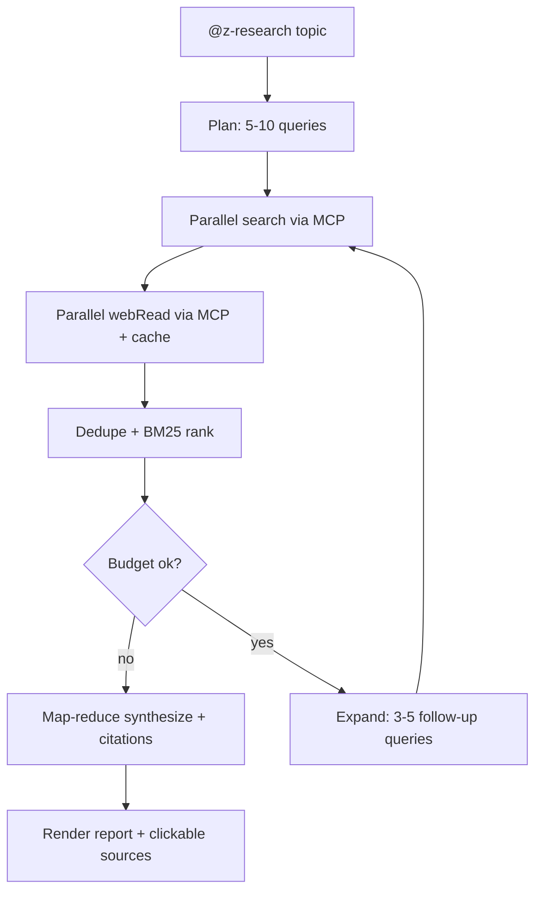

# Z.AI for GitHub Copilot Chat

> **Use [Z.AI](https://z.ai) GLM models directly in GitHub Copilot Chat — no Copilot Pro/Enterprise subscription needed. Just bring your own API key (BYOK).**

[](./LICENSE)
[](https://code.visualstudio.com/)
[](https://z.ai)

---

## What Is This?

**Z.AI for GitHub Copilot Chat** is a VS Code extension that registers [Z.AI](https://z.ai) GLM series models — including **GLM-5.2**, **GLM-5.1**, **GLM-5**, and **GLM-4.7** — into **GitHub Copilot Chat** via the official VS Code *Language Model Chat Provider API*.

This lets you pick and use Z.AI GLM models directly from the Copilot Chat model picker, just like selecting GPT-4 or Claude — no extra Copilot Pro/Enterprise subscription required. Simply enter your Z.AI API key.

| Model | Context | Max Output | Vision | Description |
|---|---:|---:|:---:|---|
| **GLM-5.2** | 1M | 128K | ❌ | New flagship, 1M context, powerful coding & long-horizon tasks |
| **GLM-5.1** | 200K | 128K | ❌ | Flagship, optimized for long-horizon tasks |
| **GLM-5** | 200K | 128K | ❌ | Next-generation GLM, agentic planning |
| **GLM-5-Turbo** | 200K | 128K | ❌ | Enhanced GLM-5 for complex long tasks |
| **GLM-4.7** | 200K | 128K | ❌ | High-intelligence model, strong coding |
| **GLM-4.6** | 200K | 128K | ❌ | High-performance, 200K context upgrade |
| **GLM-4.5** | 128K | 96K | ❌ | Balanced performance and cost |
| **GLM-4.5-Air** | 128K | 96K | ❌ | High cost-performance ratio |
| **GLM-4.5-AirX** | 128K | 96K | ❌ | High-speed variant of GLM-4.5-Air |
| **GLM-4.5-Flash** | 128K | 96K | ❌ | Free, fastest GLM text model |
| **GLM-5V-Turbo** | 200K | 128K | ✅ | Multimodal vision + coding base model |
| **GLM-4.6V** | 128K | 32K | ✅ | Visual reasoning with tool calling |
| **GLM-4.6V-Flash** | 128K | 32K | ✅ | Free vision model with tool calling |

---

## ✨ Features

- **BYOK** — configure your Z.AI API key once, all models are available
- **Live model list** — fetches available models from Z.AI API on every startup
- **Bundled fallback** — works offline or if the API is unreachable, using a curated model table with accurate token limits
- **Per-model token limits** — precise context window and max output token values per model, not a single global cap
- **Tool-calling support** — forwards tool schemas using OpenAI-compatible chat completions
- **Reasoning debug** — opt-in `reasoning_content` logging to the Z.AI output channel
- **Diagnostics command** — one-click markdown report showing exactly which models VS Code has registered
- **Deep research** — `@z-research` chat participant that registers Z.AI's MCP Web Search + Web Reader servers and orchestrates them across many iterations to produce cited research reports. See [Deep Research](#-deep-research) below.

---

## 🔬 Deep Research

The extension registers Z.AI's remote **MCP servers** for Web Search and Web Reader, making them available natively to Copilot Agent. The `@z-research` participant then orchestrates them across many iterations to produce a multi-source, cited research report — far beyond the 2–3 links the built-in Copilot web search returns.

### How it works

Z.AI's Web Search and Web Reader are MCP servers (not REST endpoints). They are billed against the **GLM Coding Plan's shared monthly MCP quota**, not the general API balance — so no top-up is needed.

| MCP Server | Tool | Streamable HTTP URL |
|---|---|---|
| Z.AI Web Search (Coding Plan) | `webSearchPrime` | `https://api.z.ai/api/mcp/web_search_prime/mcp` |
| Z.AI Web Reader (Coding Plan) | `webReader` | `https://api.z.ai/api/mcp/web_reader/mcp` |

| Plan | Monthly MCP quota (Web Search + Web Reader combined) |
|---|---|
| Lite | 100 |
| Pro | 1,000 |
| Max | 4,000 |

### `@z-research` participant (multi-iteration, hundreds of sources)

For thorough research the participant runs its own loop, bypassing Copilot's per-turn tool-call cap:

1. **Plan** — the synthesis model generates 5–10 diverse search queries from your topic.
2. **Search** — queries run in parallel (bounded by `zai.research.concurrency`) via the `webSearchPrime` MCP tool.
3. **Read** — top URLs are fetched via the `webReader` MCP tool with two-tier caching.
4. **Rank** — sources are deduped and scored (BM25-style term overlap + recency boost).
5. **Expand** — if budget remains and coverage is thin, new queries are generated from the gaps and the loop repeats.
6. **Synthesise** — sources are chunked, each chunk is summarised (map), then a final cited report is produced (reduce).



**Usage:**

`@z-research <topic>` — single entry point, no slash commands.

- **Default mode (quick):** ~20 sources, 1–2 iterations, ~30s. Cheap and fast.
- **Deep mode:** include keywords like `deep`, `thorough`, `comprehensive`, `lengkap`, or `menyeluruh` in your prompt → up to 100+ sources, up to 5 iterations. Slower but thorough.

Examples:
- `@z-research pricing kompetitor SaaS WhatsApp di Indonesia 2026` — quick mode
- `@z-research deep research complete state of agentic coding tools June 2026` — deep mode

### First-time setup

The MCP servers are **not** registered as a VS Code definition provider (that would surface them as `@<server-label>` mentions in the chat picker and add noise). Instead, run the setup command once to write the MCP configuration to your user `mcp.json`:

1. Open the Command Palette and run **Z.AI: Set API Key** (if you haven't already).
2. Open the Command Palette and run **Z.AI: Setup MCP Servers**. This writes the Web Search and Web Reader servers to `~/Library/Application Support/Code/User/mcp.json` (macOS), `%APPDATA%\Code\User\mcp.json` (Windows), or `~/.config/Code/User/mcp.json` (Linux).
3. Click **Reload** in the prompt to restart VS Code.
4. Once reloaded, the MCP tools (`webSearchPrime`, `webReader`) become available to `@z-research`.

The participant will display a clear error if the MCP tools are not yet connected.

The final response is a markdown report with inline `[n]` citations and a clickable **Sources** list.

> **📚 Implementation history** — see [`doc/deep-research-journey.md`](./doc/deep-research-journey.md) for the complete build log: phases, rolled-back approaches, 10 production bugs with root-cause analysis, and lessons learned.

---

## Requirements

- VS Code **1.120.0** or higher with the Language Model Chat Provider API
- **GitHub Copilot Chat** extension — [install from marketplace](https://marketplace.visualstudio.com/items?itemName=GitHub.copilot-chat) (required — this extension only adds models *into* Copilot Chat)
- Sign in to GitHub Copilot Chat (a personal GitHub account is sufficient — **no** Copilot Pro/Enterprise needed for BYOK)
- A **Z.AI API key** — get one at [z.ai](https://z.ai)

---

## ⚡ Quick Start

1. Install **GitHub Copilot Chat** from the marketplace if you haven't already.
2. Install this extension (or press `F5` in the repo to launch an Extension Development Host).
3. Open **GitHub Copilot Chat** (click the Copilot icon in the sidebar or press `Cmd+Shift+I` / `Ctrl+Shift+I`).
4. Click the **model picker** (current model name) → **Manage Models…**
5. Select **Z.AI**.
6. Press `Enter` to accept the default **Group Name**.
7. Enter your Z.AI **API Key** when prompted — VS Code stores it securely as a secret.
8. Choose the models you want available.
9. Select any Z.AI model from the picker and start chatting.

> **💡 Tips:**
> - Registered models are automatically available in the Copilot Chat model picker — no extra setup needed.
> - If a model appears in the **Language Models** view but not in the chat picker, hover its row and click the eye icon (👁) to enable visibility.

---

## Commands

Once installed, Z.AI models appear directly in the **GitHub Copilot Chat model picker** — no special commands needed. The easiest way to manage your API key is via **Settings → Language Models** (gear icon ⚙).

For advanced usage, you can also run these commands via the Command Palette (`Cmd+Shift+P` / `Ctrl+Shift+P`):

| Command | Description |
|---|---|
| `Z.AI: Manage Provider` | Manage API key, refresh models, or test connection |
| `Z.AI: Set API Key` | Store or update your Z.AI API key |
| `Z.AI: Diagnostics` | Show a markdown report of all registered Z.AI models |

> **Note:** The native BYOK flow via **Language Models** (gear icon ⚙) is recommended.

---

## Coding Plan quota

When your API key belongs to a Z.AI Coding Plan subscription, the extension shows a quota indicator `$(graph) Z · NN%` on the right side of the status bar:

- **Hover** the indicator to see a graphical SVG donut chart with two concentric rings — the outer ring for the weekly quota, the inner ring for the rolling 5-hour quota. Each ring is colour-coded: blue (normal), yellow (≥80%), red (≥95%). Below the chart: usage percentages and reset countdowns.
- **Click** the indicator to toggle the status-bar text between the 5-hour and weekly view.
- The indicator background turns **yellow** at 80% usage and **red** at 95%.
- **Z.AI: Manage Provider → Show Quota** opens a detailed markdown report with all quota windows.

The quota is fetched from `https://api.z.ai/api/monitor/usage/quota/limit` and auto-refreshes every 5 minutes (configurable via `zai.quotaRefreshInterval`).

> **If quota data is unavailable** (e.g. no API key set, or the key doesn't belong to a Coding Plan), the status bar shows a persistent `$(graph) Z.AI quota` item with a tooltip linking to **Z.AI: Set API Key**.

---

## Settings

| Setting | Type | Default | Description |
|---|---|---|---|
| `zai.temperature` | `number` | `0.2` | Sampling temperature for chat completions (`0`–`2`) |
| `zai.maxTokens` | `number` | `0` | Max output token override — `0` uses the per-model bundled maximum |
| `zai.maxInputTokens` | `number` | `0` | Context window override — `0` uses the per-model bundled context size |
| `zai.debugReasoning` | `boolean` | `false` | Write provider `reasoning_content` to **Output → Z.AI** for debugging |
| `zai.requestTimeout` | `number` | `180000` | Connection timeout in ms. Auto-scaled **1.5×** for 200K flagship models (glm-5.1/5/4.7) and capped at 300000ms. Inactivity timer scales the same way (90–180s window). |
| `zai.maxRetries` | `number` | `2` | Automatic retries on transient network errors (fetch failed, timeout, 5xx, 429) with exponential backoff (1s → 2s → max 10s + jitter). |
| `zai.showUsageStatusBar` | `boolean` | `true` | Show the latest Z.AI usage summary (prompt→output tokens) in the VS Code status bar after each response. |
| `zai.showQuotaStatusBar` | `boolean` | `true` | Show the Z.AI Coding Plan quota (5-hour / weekly) in the VS Code status bar. Hover for a graphical SVG donut chart; click to toggle between windows. |
| `zai.quotaRefreshInterval` | `number` | `5` | How often (in minutes) to refresh the Z.AI Coding Plan quota. `0` disables automatic refresh. |
| `zai.experimentalContextIndicator` | `boolean` | `false` | Experimental: attempt to fill the Copilot Chat context indicator with real Z.AI token usage. Depends on VS Code internals. |
| `zai.research.maxSources` | `number` | `100` | Max sources fetched during a `@z-research` run when deep mode is triggered. Lower to reduce cost/latency. |
| `zai.research.maxIterations` | `number` | `5` | Max query-expansion iterations before synthesis (`1`–`10`). |
| `zai.research.concurrency` | `number` | `3` | Parallel HTTP requests during search + read phases. Higher is faster but may hit the Z.AI MCP rate limit (~3-5 req/s safe). |
| `zai.research.cacheTTL` | `number` | `3600` | Cache TTL in seconds for Z.AI search + read results. `0` disables caching. |
| `zai.research.synthesisModel` | `string` | `glm-5.2` | Z.AI model used for planning queries and synthesising the final report. Use a high-context model for deep research. |

---

## Troubleshooting

### "Request timed out for glm-5.1" / "Connection timed out after …"

Flagship 200K-context models (`glm-5.1`, `glm-5`, `glm-5-turbo`, `glm-4.7`) have noticeably higher cold-start latency than smaller models — they can take 60–120s to send the **first token** on long or busy sessions.

**The extension already mitigates this automatically:**

- `zai.requestTimeout` defaults to **180000ms (3 min)** — was 120000ms in 0.1.x
- The effective connection timeout is auto-scaled to **1.5×** for 200K flagship models (so 180s base → 270s)
- The inactivity timer auto-scales the same way, with a **90s minimum floor** (was 30s)

If you still hit timeouts:

1. **Retry** — Z.AI servers sometimes spike under load; the same prompt may succeed in a few seconds
2. **Increase `zai.requestTimeout`** in Settings (e.g. 300000 = 5 min max)
3. **Try a faster model** like `glm-4.5-flash` or `glm-4.7-flash` for code-completion / quick-edit tasks
4. **Clear chat history** to reduce input token count — large prefill is the main driver of cold-start latency
5. **Check the Z.AI Output channel** — every request logs `[Timeout config: model=X flagship=Y multiplier=Z× connectionTimeout=…]` so you can confirm which budget was applied

If the issue persists with `zai.requestTimeout = 300000` and a small context, the Z.AI API itself is the bottleneck — try a different Z.AI region/plan or contact [Z.AI support](https://z.ai).

---

## Models

The extension fetches the live model list from:

```
https://api.z.ai/api/coding/paas/v4/models
```

Because the Z.AI API returns model IDs only, a bundled metadata table provides context window and max output tokens per model. If the live fetch fails, the bundled list is used as a fallback.

VS Code and Copilot read separate input/output metadata fields for UI display. GLM models can have very large output limits, so the extension advertises a small response reserve to keep the **Language Models** table, model picker tooltip, and chat context indicator consistent while still sending each model's full bundled max output limit to the Z.AI API.

### Bundled model limits

| Model | Context window | Max output tokens | Vision |
|---|---:|---:|:---:|
| `glm-4.7` | 200K (204,800) | 128K (131,072) | ❌ |
| `glm-5` | 200K (204,800) | 128K (131,072) | ❌ |
| `glm-5.1` | 200K (204,800) | 128K (131,072) | ❌ |
| `glm-4.5-air` | 128K (131,072) | 96K (98,304) | ❌ |
| `glm-4.5-flash` | 128K (131,072) | 96K (98,304) | ❌ |
| `glm-5v-turbo` | 200K (204,800) | 128K (131,072) | ✅ |
| `glm-4.6v` | 128K (131,072) | 32K (32,768) | ✅ |
| `glm-4.6v-flash` | 128K (131,072) | 32K (32,768) | ✅ |

Set `zai.maxInputTokens` or `zai.maxTokens` to a non-zero value to override the bundled defaults globally.

All models use the OpenAI-compatible chat completions endpoint:

```
https://api.z.ai/api/coding/paas/v4/chat/completions
```

---

## Development

```bash
# Install dependencies
npm install

# Compile TypeScript
npm run compile

# Watch mode
npm run watch
```

Press `F5` in VS Code to launch an **Extension Development Host** with the extension loaded.

To package a `.vsix` for local install:

```bash
npm run package
```

### Tests

The quota module has a unit test suite using Node's built-in test runner:

```bash
npx tsx --test src/test/quota.test.ts
```

Covers `parseQuotaSnapshot`, quota window selection, `formatResetCountdown`, SVG donut generation (including clamping), `escapeMarkdown`, `QuotaAuthError` detection, and the `fetchQuotaSnapshot` auth-retry flow.

---

## Contributing

Issues and pull requests are welcome. Please open an issue first for significant changes so we can discuss the approach.

### Contributors

- **[@nik13513513](https://github.com/nik13513513)** (Alex Kor) — Z.AI Coding Plan quota tracking, graphical SVG donut tooltip, quota auth error handling, and test suite ([PR #2](https://github.com/ltmoerdani/zai-copilot-chat/pull/2), [PR #3](https://github.com/ltmoerdani/zai-copilot-chat/pull/3))

---

## License

MIT — see [LICENSE](./LICENSE) for details.
