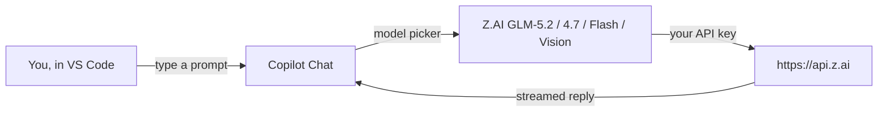
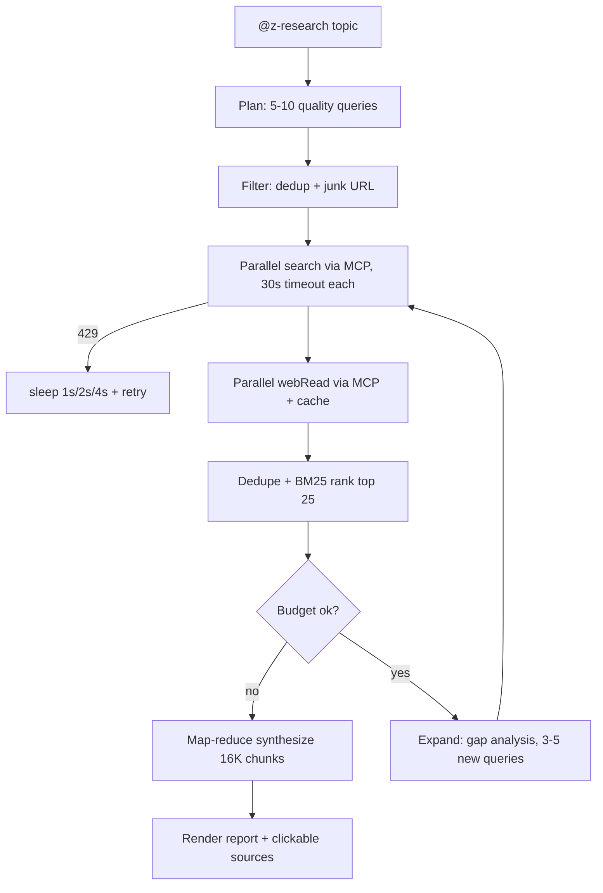

<div align="center">

# 🧠 Z.AI for GitHub Copilot Chat

### Use **13+ Z.AI GLM models** (GLM-5.2 1M context, GLM-4.7, free Flash + Vision) in GitHub Copilot Chat — **no Copilot Pro needed**

**BYOK • Free tier included • Deep-research agent built in**

[](./LICENSE)
[](https://code.visualstudio.com/)
[](https://z.ai)
[](#-models)
[](#-models)

**[Why bother](#-why-bother)** · **[Quick Start](#-quick-start)** · **[Models](#-models)** · **[Copilot vs This](#-github-copilot-vs-this-extension)** · **[Deep Research](#-deep-research)** · **[FAQ](#-faq)** · **[Community](#-community)**

</div>

---

> ### 💡 The pitch
>
> **GitHub Copilot Chat is great, but you're locked to the models GitHub picks for you.** This extension lets you bring your own Z.AI API key and chat with GLM-5.2 (1M context), GLM-4.7, GLM-5, plus free Flash and Vision models — right inside the Copilot Chat you already use. No Copilot Pro subscription, no second editor. There's also a `@z-research` agent that fetches dozens of cited sources and writes you a report.



## 🔥 Why bother

You already love Copilot Chat. Now imagine it powered by Z.AI's GLM models — a 1M-context flagship, a free Flash tier, vision models that read screenshots, and a built-in deep-research agent that hands you a cited report.

| | What you get |
|---|---|
| 💸 **Cost** | Free GitHub account + Z.AI API key. No Copilot Pro ($10/mo) or Pro+ ($39/mo) needed |
| 🌍 **Models** | 13+ GLM models: GLM-5.2, GLM-5.1, GLM-5, GLM-4.7, GLM-4.6, GLM-4.5, Air, AirX |
| 🤖 **Agent Mode** | `@z-research` deep-research agent with dozens of cited sources |
| 🧠 **1M context** | GLM-5.2 holds ~1 million tokens — paste an entire repo or a book chapter |
| 👁️ **Vision** | GLM-5V-Turbo, GLM-4.6V, GLM-4.6V-Flash read screenshots and diagrams |
| 🆓 **Free models** | `glm-4.5-flash` (text) and `glm-4.6v-flash` (vision) are $0 on Z.AI |
| 🔒 **Key storage** | Your API key is stored in VS Code SecretStorage, never sent anywhere but Z.AI |
| 🔓 **Open source** | MIT, readable code, contributions welcome |

---

## 📊 GitHub Copilot vs This Extension

> **Not a replacement** — this extension *adds* models *into* Copilot Chat. Think of it as unlocking the model picker.

| | Copilot Free | Copilot Pro ($10/mo) | Copilot Pro+ ($39/mo) | **This Extension (BYOK)** |
|---|:---:|:---:|:---:|:---:|
| GLM-5.2 (1M context) | ❌ | ❌ | ❌ | ✅ |
| GLM-4.7 / GLM-5 / GLM-5.1 | ❌ | ❌ | ❌ | ✅ |
| Vision models (GLM-4.6V) | ❌ | ❌ | ❌ | ✅ |
| Free tier (Flash models) | ❌ | ❌ | ❌ | ✅ $0 |
| Deep-research agent (`@z-research`) | ❌ | ❌ | ❌ | ✅ |
| GPT-5 / Claude / Gemini | ❌ | ✅ | ✅ | ❌ (use Copilot's own models) |
| Monthly cost | $0 | $10 | $39 | $0 + Z.AI usage |

You pay Z.AI per-token (or use the free Flash models). No middleman subscription.

---

## What Is This?

**Z.AI for GitHub Copilot Chat** is a VS Code extension that registers [Z.AI](https://z.ai) GLM models (including **GLM-5.2**, **GLM-5.1**, **GLM-5**, and **GLM-4.7**) into **GitHub Copilot Chat** through the official VS Code *Language Model Chat Provider API*.

You pick a Z.AI GLM model from the Copilot Chat model picker the same way you would pick GPT-4 or Claude. Enter your Z.AI API key once, and that's it. No Copilot Pro or Enterprise subscription needed.

| Model | Context | Max Output | Vision | Description |
|---|---:|---:|:---:|---|
| **GLM-5.2** | 1M | 128K | ❌ | Newest flagship, 1M context window, focused on coding and long-horizon tasks |
| **GLM-5.1** | 200K | 128K | ❌ | Flagship tuned for long-horizon tasks |
| **GLM-5** | 200K | 128K | ❌ | Latest GLM generation with agentic planning |
| **GLM-5-Turbo** | 200K | 128K | ❌ | GLM-5 variant for long, complex tasks |
| **GLM-4.7** | 200K | 128K | ❌ | Strong at coding, high overall capability |
| **GLM-4.6** | 200K | 128K | ❌ | 200K context, general performance |
| **GLM-4.5** | 128K | 96K | ❌ | Balance of performance and cost |
| **GLM-4.5-Air** | 128K | 96K | ❌ | Better cost-to-performance ratio |
| **GLM-4.5-AirX** | 128K | 96K | ❌ | Faster variant of GLM-4.5-Air |
| **GLM-4.5-Flash** | 128K | 96K | ❌ | Free, fastest text model in the lineup |
| **GLM-5V-Turbo** | 200K | 128K | ✅ | Vision + coding base model |
| **GLM-4.6V** | 128K | 32K | ✅ | Visual reasoning with tool calling |
| **GLM-4.6V-Flash** | 128K | 32K | ✅ | Free vision model with tool calling |

---

## ✨ Features

- **Bring your own key.** Enter your Z.AI API key once, every model is unlocked.
- **Live model list.** The extension pulls the current Z.AI lineup on startup, so new models appear automatically.
- **Works offline too.** If the API is unreachable, a bundled table with accurate per‑model token limits takes over.
- **Per‑model token limits.** Context window and max output tokens are set per model, not as one blunt global cap.
- **Tool calling.** Tool schemas are forwarded using OpenAI‑compatible chat completions, so agents keep working.
- **Reasoning debug.** Opt‑in `reasoning_content` logging to the Z.AI output channel, for when you want to see the model think out loud.
- **One‑click diagnostics.** A markdown report showing exactly which models VS Code has registered.
- **Deep research agent.** The `@z-research` chat participant runs Z.AI's MCP Web Search and Web Reader across several iterations to produce a cited research report. See [Deep Research](#-deep-research) below.
- **Progress you can actually see.** Each completed search query is pushed to the chat as a progress update, not one big batch at the end.
- **Built to survive Z.AI's quirks.** The extension handles double‑encoded JSON responses, retries on rate‑limit (429) with exponential backoff, and enforces a per‑call timeout so a single hung MCP call can't freeze your run.
- **Junk URL filter.** Instagram, TikTok, YouTube, asset CDNs, and "how to host" guides are dropped at the candidate stage. That alone saves a 30s timeout per junk URL.

---

## 🔬 Deep Research

The extension registers Z.AI's remote **MCP servers** for Web Search and Web Reader and exposes them to Copilot Agent. The `@z-research` participant then runs them across several iterations to produce a multi‑source, cited research report. The result goes well past the two or three links the built‑in Copilot web search returns.

> **The pitch in one line:** type `@z-research who is winning the on‑device LLM race in 2026`, wait a few minutes, get back a cited markdown report with dozens of ranked sources.

### How it works

Z.AI's Web Search and Web Reader are MCP servers, not REST endpoints. Usage is billed against the **GLM Coding Plan's shared monthly MCP quota**, not the general API balance, so no top-up is needed.

| MCP Server | Tool | Streamable HTTP URL |
|---|---|---|
| Z.AI Web Search (Coding Plan) | `webSearchPrime` | `https://api.z.ai/api/mcp/web_search_prime/mcp` |
| Z.AI Web Reader (Coding Plan) | `webReader` | `https://api.z.ai/api/mcp/web_reader/mcp` |

| Plan | Monthly MCP quota (Web Search + Web Reader combined) |
|---|---|
| Lite | 100 |
| Pro | 1,000 |
| Max | 4,000 |

### `@z-research` participant (multi-iteration, hundreds of sources)

For thorough research the participant runs its own loop, which lets it bypass Copilot's per-turn tool-call cap:

1. **Plan**: the synthesis model generates 5 to 10 search-engine-friendly queries. These favour concrete entities, action-oriented phrasing, and a 3 to 8 keyword sweet spot.
2. **Filter**: candidates pass through the junk URL filter (Instagram, TikTok, YouTube, asset CDNs, "how to host" guides) and are deduplicated by URL across queries.
3. **Search**: queries run in parallel, bounded by `zai.research.concurrency`, via the `webSearchPrime` MCP tool. Each call has a 30s timeout, and 429 responses retry with exponential backoff.
4. **Read**: top URLs are fetched through the `webReader` MCP tool with two-tier caching. Junk URLs are skipped before the read.
5. **Rank**: sources are deduped and scored using a BM25-style term overlap with a recency boost. Only the top 25 most relevant sources go to synthesis.
6. **Expand**: if budget remains and coverage is thin, a **gap analysis** of the previous round's top results drives 3 to 5 follow-up queries. There are no random re-rolls.
7. **Synthesise**: the top 25 sources are chunked (16K chars each), each chunk is summarised (map), and a final cited report is produced (reduce). The synthesis LLM is steered to maximise what the sources actually cover, rather than giving up if the user's angle isn't a perfect match.

Progress is pushed to the chat as each search query completes, not as one big update at the end.



**Usage:**

`@z-research <topic>` is the single entry point. There are no slash commands.

- **Default mode (quick):** about 20 sources, 1 to 2 iterations, roughly 3 to 4 minutes end-to-end.
- **Deep mode:** include keywords like `deep`, `thorough`, `comprehensive`, `lengkap`, or `menyeluruh` in your prompt to opt in. Up to 100+ sources and 5 iterations.

Examples:
- `@z-research pricing kompetitor SaaS WhatsApp di Indonesia 2026` (quick mode)
- `@z-research deep research complete state of agentic coding tools June 2026` (deep mode)

**Typical performance** (measured on real Coding Plan runs):
- 8 to 15 search queries
- 30 to 130 candidate URLs after the junk filter
- about 25 sources actually read and ranked
- 3 to 5 LLM synthesis calls (1 reduce plus N chunk summaries)
- 2 to 4 minutes wall-clock per run

### First-time setup

**No MCP setup required.** The `@z-research` participant calls the Z.AI MCP HTTP endpoints directly via `fetch()`. The tools are **not registered** with VS Code's MCP infrastructure, so they are invisible to Copilot Agent and other chat participants. That matters: it stops Copilot Agent from auto-discovering and invoking the tools during a regular chat, which is what caused stuck sessions in earlier versions.

The only prerequisite:

1. Open the Command Palette and run **Z.AI: Set API Key** (if you haven't already).
2. Type `@z-research <topic>` in Copilot Chat.

The participant will display a clear error if the API key is not set.

The final response is a markdown report with inline `[n]` citations and a clickable **Sources** list.

> **📚 Implementation history**: [`doc/deep-research-journey.md`](./doc/deep-research-journey.md) has the full build log, covering 9 phases, 28 production bugs with root-cause analysis, 18 lessons learned, and the final architecture.

---

## Requirements

- VS Code **1.120.0** or higher with the Language Model Chat Provider API
- **GitHub Copilot Chat** extension. [Install it from the marketplace](https://marketplace.visualstudio.com/items?itemName=GitHub.copilot-chat). This extension only adds models *into* Copilot Chat.
- Sign in to GitHub Copilot Chat. A personal GitHub account is enough; **no** Copilot Pro or Enterprise needed for BYOK.
- A **Z.AI API key**. Get one at [z.ai](https://z.ai). The free Flash models mean you can start without paying anything.

---

## ⚡ Quick Start

Five minutes from zero to your first GLM reply.

1. Install **GitHub Copilot Chat** from the marketplace if you haven't already.
2. Install this extension (or press `F5` in the repo to launch an Extension Development Host).
3. Open **GitHub Copilot Chat** (click the Copilot icon in the sidebar or press `Cmd+Shift+I` / `Ctrl+Shift+I`).
4. Click the **model picker** (current model name) → **Manage Models…**
5. Select **Z.AI**.
6. Press `Enter` to accept the default **Group Name**.
7. Enter your Z.AI **API Key** when prompted. VS Code stores it securely as a secret.
8. Choose the models you want available.
9. Select any Z.AI model from the picker and start chatting.

> **💡 Tips:**
> - Registered models show up automatically in the Copilot Chat model picker.
> - If a model appears in the **Language Models** view but not in the chat picker, hover its row and click the eye icon (👁) to enable visibility.

---

## Commands

Once installed, Z.AI models appear directly in the **GitHub Copilot Chat model picker** with no extra commands. The easiest way to manage your API key is **Settings, Language Models** (gear icon ⚙).

For advanced usage, you can also run these commands via the Command Palette (`Cmd+Shift+P` / `Ctrl+Shift+P`):

| Command | Description |
|---|---|
| `Z.AI: Manage Provider` | Manage API key, refresh models, or test connection |
| `Z.AI: Set API Key` | Store or update your Z.AI API key |
| `Z.AI: Show Quota` | Open a detailed markdown report of all quota windows |
| `Z.AI: Toggle Quota View` | Switch the status bar between 5-hour and weekly display |
| `Z.AI: Diagnostics` | Show a markdown report of all registered Z.AI models |

> **Note:** The native BYOK flow via **Language Models** (gear icon ⚙) is recommended.

---

## Coding Plan quota

When your API key belongs to a Z.AI Coding Plan subscription, the extension shows a quota indicator `$(graph) Z · NN%` on the right side of the status bar:

- **Hover** the indicator to see a graphical SVG donut chart with two concentric rings. The outer ring is the weekly quota, the inner ring is the rolling 5-hour quota. Each ring is colour-coded: blue (normal), yellow at 80% or above, red at 95% or above. Below the chart: usage percentages and reset countdowns.
- **Click** the indicator to toggle the status-bar text between the 5-hour and weekly view.
- The indicator background turns **yellow** at 80% usage and **red** at 95%.
- **Z.AI: Manage Provider → Show Quota** opens a detailed markdown report with all quota windows.

The quota is fetched from `https://api.z.ai/api/monitor/usage/quota/limit` and auto-refreshes every 5 minutes (configurable via `zai.quotaRefreshInterval`).

> **If quota data is unavailable** (for example, no API key set, or the key doesn't belong to a Coding Plan), the status bar shows a persistent `$(graph) Z.AI quota` item with a tooltip linking to **Z.AI: Set API Key**.

---

## Settings

| Setting | Type | Default | Description |
|---|---|---|---|
| `zai.temperature` | `number` | `0.2` | Sampling temperature for chat completions (`0`–`2`) |
| `zai.maxTokens` | `number` | `0` | Max output token override. `0` uses the per-model bundled maximum. |
| `zai.maxInputTokens` | `number` | `0` | Context window override. `0` uses the per-model bundled context size. |
| `zai.debugReasoning` | `boolean` | `false` | Write provider `reasoning_content` to **Output → Z.AI** for debugging |
| `zai.requestTimeout` | `number` | `180000` | Connection timeout in ms. Auto-scaled **1.5×** for 200K flagship models (glm-5.1/5/4.7) and capped at 300000ms. Inactivity timer scales the same way (90–180s window). |
| `zai.maxRetries` | `number` | `2` | Automatic retries on transient network errors (fetch failed, timeout, 5xx, 429) with exponential backoff (1s → 2s → max 10s + jitter). |
| `zai.defaultModel` | `string` | `""` | Model id to mark as the default selection in the Copilot Chat model picker (for example `glm-5.2`). Leave empty to mark no model as default; users can still pick any model manually. |
| `zai.showUsageStatusBar` | `boolean` | `true` | Show the latest Z.AI usage summary (prompt→output tokens) in the VS Code status bar after each response. |
| `zai.showQuotaStatusBar` | `boolean` | `true` | Show the Z.AI Coding Plan quota (5-hour / weekly) in the VS Code status bar. Hover for a graphical SVG donut chart; click to toggle between windows. |
| `zai.quotaRefreshInterval` | `number` | `5` | How often (in minutes) to refresh the Z.AI Coding Plan quota. `0` disables automatic refresh. |
| `zai.experimentalContextIndicator` | `boolean` | `false` | Experimental: attempt to fill the Copilot Chat context indicator with real Z.AI token usage. Depends on VS Code internals. |
| `zai.research.maxSources` | `number` | `100` | Max sources fetched during a `@z-research` run when deep mode is triggered. Lower to reduce cost/latency. |
| `zai.research.maxIterations` | `number` | `5` | Max query-expansion iterations before synthesis (`1`–`10`). |
| `zai.research.concurrency` | `number` | `3` | Parallel MCP calls during search + read phases. Higher is faster but may hit the Z.AI MCP rate limit (~3-5 req/s safe). |
| `zai.research.cacheTTL` | `number` | `3600` | Cache TTL in seconds for Z.AI search + read results. `0` disables caching. |
| `zai.research.synthesisModel` | `string` | `glm-5.2` | Z.AI model used for planning queries and synthesising the final report. Use a high-context model (e.g. glm-5.2 with 1M context) for deep research. |
| `zai.research.webSearchToolName` | `string` | `web_search_prime` | VS Code tool name for the Z.AI Web Search MCP server. The default matches the snake_case form VS Code exposes (e.g. `mcp_mcp-web-searc_web_search_prime`). Override if VS Code's MCP tool name format changes. |
| `zai.research.webReaderToolName` | `string` | `webReader` | VS Code tool name for the Z.AI Web Reader MCP server. Default matches the camelCase form VS Code exposes. Override if VS Code's MCP tool name format changes. |

---

## Troubleshooting

### "Request timed out for glm-5.1" / "Connection timed out after …"

Flagship 200K-context models (`glm-5.1`, `glm-5`, `glm-5-turbo`, `glm-4.7`) have noticeably higher cold-start latency than the smaller models. On long or busy sessions they can take 60 to 120s to send the **first token**.

**The extension already mitigates this automatically:**

- `zai.requestTimeout` defaults to **180000ms (3 min)**. It was 120000ms in 0.1.x.
- The effective connection timeout is auto-scaled to **1.5×** for 200K flagship models, so 180s base becomes 270s.
- The inactivity timer scales the same way, with a **90s minimum floor** (was 30s).

If you still hit timeouts:

1. **Retry.** Z.AI servers sometimes spike under load; the same prompt may succeed a few seconds later.
2. **Increase `zai.requestTimeout`** in Settings (for example, 300000 = 5 min max).
3. **Try a faster model** like `glm-4.5-flash` or `glm-4.7-flash` for code-completion or quick-edit tasks.
4. **Clear chat history** to reduce input token count. Large prefill is the main driver of cold-start latency.
5. **Check the Z.AI Output channel.** Every request logs `[Timeout config: model=X flagship=Y multiplier=Z× connectionTimeout=…]`, so you can confirm which budget was applied.

If the issue persists with `zai.requestTimeout = 300000` and a small context, the Z.AI API itself is the bottleneck. Try a different Z.AI region or plan, or contact [Z.AI support](https://z.ai).

### "Z.AI model not selectable in the model picker" / "Can't pin Z.AI model"

The Z.AI extension only sends the **official** `LanguageModelChatInformation` fields to VS Code. Non-API fields like `category` and `isUserSelectable` are not part of the public VS Code API, and sending them can make the picker misbehave or crash. See [doc/vscode-126-chatmodel-picker-crash.md](./doc/vscode-126-chatmodel-picker-crash.md) for the original incident.

If the model picker doesn't show your Z.AI models or they can't be pinned:

1. **Make sure Z.AI models are enabled in the picker.** Open the picker, search for "Z.AI", and click the eye (👁) icon to enable visibility. The eye icon is in the **Language Models** view (gear icon ⚙ → Z.AI) and toggles whether the model is listed in the picker.
2. **Pin a model as default.** Set `zai.defaultModel` in your user settings (e.g. `glm-5.2`). The extension marks that model as `isDefault: true` so VS Code highlights it in the picker and seeds new chat sessions with it.
3. **Reload the window** after changing `zai.defaultModel` (the model list is cached per-window).

If the picker still misbehaves:

- Open **Developer Tools** (`Cmd+Shift+P` → "Developer: Toggle Developer Tools") and look for console errors when you open the picker.
- Check **Output → Z.AI** for any error logs from the model provider.
- File an issue with the console error and your VS Code version.

### "@z-research: Z.AI API key is not set"

The `@z-research` participant calls the Z.AI MCP HTTP endpoints directly. It needs your Z.AI API key to authenticate.

1. Run **Z.AI: Set API Key** from the Command Palette.
2. Re-run `@z-research <topic>`.

> **Note:** In v0.3.0, a `Z.AI: Setup MCP Servers` command was used to write `mcp.json`. This command was removed in v0.3.1: the extension now calls the Z.AI MCP endpoints directly via HTTP. If you have `zai-web-search-prime` or `zai-web-reader` entries in your `mcp.json`, you can safely remove them; they are no longer needed.

### "@z-research: No usable sources were found"

Several possible causes:

1. **Search queries returned empty results.** The topic may be too niche. Try rephrasing with concrete keywords.
2. **All top URLs were filtered as junk.** If every returned URL was social-media or an asset CDN, the filter dropped them all. Try a more specific topic with named entities, for example "World Archery 2024 registration rules" instead of "archery registration".
3. **Every read timed out.** Check the Output channel for `[mcp-tools] Timeout (30000ms)` entries. If there are many, your Z.AI MCP servers may be rate-limited or unreachable.

The diagnostic log is in **Output → Z.AI Research** and includes every search query, every read, and the parsed result count.

### "@z-research takes 4+ minutes"

That's the normal end-to-end time for a deep-mode run. The wall-clock time is bounded by:

- **Search phase**: bounded by `zai.research.concurrency` (default 3) and the 30s per-call timeout.
- **Read phase**: up to about 25 source reads in parallel, again 30s timeout each.
- **Synth phase**: 3 to 5 LLM calls (1 reduce plus N chunk summaries) on the synthesis model. With `glm-5.2` (1M context), this is fast.

To shorten: use **quick mode** (omit `deep` / `thorough` / `menyeluruh` keywords from your prompt), lower `zai.research.maxSources`, or pick a smaller synthesis model.

### "@z-research hits MCP rate limit (-429)"

The participant automatically retries with exponential backoff (1s / 2s / 4s) on rate-limit responses. If you see persistent 429s in the log:

- Lower `zai.research.concurrency` to `2` (default is 3).
- The Z.AI Coding Plan has a monthly MCP quota (Lite=100, Pro=1K, Max=4K calls). Check your usage in the Z.AI dashboard.

### "@z-research search query stuck/hangs"

Each MCP call has a **30s per-call timeout**. A hung call is logged as `[mcp-tools] Timeout (30000ms) for search "..."  giving up on this query` and the orchestrator continues. If you see many timeouts:

- Z.AI's MCP server may be having a transient issue. Try again in a minute.
- The query itself may be problematic. If a particular query consistently times out, consider rewording it in your prompt.

---

## Models

The extension fetches the live model list from:

```
https://api.z.ai/api/coding/paas/v4/models
```

Because the Z.AI API returns model IDs only, a bundled metadata table provides context window and max output tokens per model. If the live fetch fails, the bundled list is used as a fallback.

VS Code and Copilot read separate input and output metadata fields for the UI. GLM models can have very large output limits, so the extension advertises a small response reserve. That keeps the **Language Models** table, the model picker tooltip, and the chat context indicator consistent, while still sending each model's full bundled max output limit to the Z.AI API.

### Bundled model limits

| Model | Context window | Max output tokens | Vision |
|---|---:|---:|:---:|
| `glm-4.7` | 200K (204,800) | 128K (131,072) | ❌ |
| `glm-5` | 200K (204,800) | 128K (131,072) | ❌ |
| `glm-5.1` | 200K (204,800) | 128K (131,072) | ❌ |
| `glm-4.5-air` | 128K (131,072) | 96K (98,304) | ❌ |
| `glm-4.5-flash` | 128K (131,072) | 96K (98,304) | ❌ |
| `glm-5v-turbo` | 200K (204,800) | 128K (131,072) | ✅ |
| `glm-4.6v` | 128K (131,072) | 32K (32,768) | ✅ |
| `glm-4.6v-flash` | 128K (131,072) | 32K (32,768) | ✅ |

Set `zai.maxInputTokens` or `zai.maxTokens` to a non-zero value to override the bundled defaults globally.

All models use the OpenAI-compatible chat completions endpoint:

```
https://api.z.ai/api/coding/paas/v4/chat/completions
```

---

## Development

```bash
# Install dependencies
npm install

# Compile TypeScript
npm run compile

# Watch mode
npm run watch
```

Press `F5` in VS Code to launch an **Extension Development Host** with the extension loaded.

To package a `.vsix` for local install:

```bash
npm run package
```

### Tests

Two test suites, both using Node's built-in test runner:

```bash
# Quota module
npx tsx --test src/test/quota.test.ts

# Deep research modules
npm test
```

The `npm test` runner covers 9 `vscode`-free pure modules: `mcpInputBuilders` (5), `mcpResponseParser` (15), `mcpRateLimit` (6), `mcpTimeout` (5), `mcpToolNameResolver` (9), `junkUrlFilter` (10), `ranker` (5), `budget` (5), `cache` (5), plus URL dedup (5). **75 tests, 100% pass rate, runs in ~600ms.**

---

## ❓ FAQ

### Do I need Copilot Pro?

No. A free GitHub account is enough. Copilot Chat itself is free to use, and this extension adds Z.AI models into it via the Language Model Chat Provider API. You only pay for Z.AI API usage (or use the free Flash models).

### Is this an official Z.AI or GitHub extension?

No. This is an independent, open-source project. Z.AI and GitHub Copilot are not affiliated with this extension. It uses their public APIs.

### Do the models work with Copilot Agent / tool calling?

Yes. Tool schemas are forwarded using OpenAI-compatible chat completions, so agents and tool calling keep working.

### Is it really free?

The extension is free and open source (MIT). Z.AI offers `glm-4.5-flash` (text) and `glm-4.6v-flash` (vision) for **$0**. Other models are pay-per-token. Check [z.ai](https://z.ai) for current pricing.

### What's the difference between this and Copilot's built-in web search?

Copilot's built-in search returns 2–3 links. The `@z-research` participant runs a multi-iteration loop that fetches 20–100+ sources, reads them, ranks by BM25 + recency, and writes a cited markdown report. It's a different class of research.

### Can I use this without Copilot Chat?

No. This extension only adds models *into* GitHub Copilot Chat. You need the [Copilot Chat extension](https://marketplace.visualstudio.com/items?itemName=GitHub.copilot-chat) installed and signed in.

---

## 💬 Community

- **Found a bug or have a feature idea?** [Open an issue](https://github.com/ltmoerdani/zai-copilot-chat/issues)
- **Want to contribute?** [Pull requests welcome](https://github.com/ltmoerdani/zai-copilot-chat/pulls) — see [Contributing](#contributing) below
- **Star the repo** ⭐ if this saved you a subscription or a research afternoon. Word of mouth is how side projects reach the people who need them.
- **Leave a review** on the [VS Code Marketplace](https://marketplace.visualstudio.com/items?itemName=ltmoerdani.zai-copilot-chat) — it helps others find the extension.

### 🪶 Also from this publisher

Looking for **OpenCode Zen / Go** models (DeepSeek, Kimi, Qwen, MiMo, MiniMax) in Copilot Chat? Check out [**OpenCode Copilot Chat**](https://marketplace.visualstudio.com/items?itemName=ltmoerdani.opencode-copilot-chat) — 5,000+ installs, 30+ models.

---

## Contributing

Issues and pull requests are welcome. If you are planning a bigger change, please open an issue first so we can talk through the approach.

If this extension saved you a Copilot Pro subscription, a coffee, or a research afternoon, the nicest thing you can do is **star the repo** and tell one friend who would care. Word of mouth is how side projects like this reach the people who need them.

### Contributors

- **[@nik13513513](https://github.com/nik13513513)** (Alex Kor): Z.AI Coding Plan quota tracking, graphical SVG donut tooltip, quota auth error handling, and the test suite ([PR #2](https://github.com/ltmoerdani/zai-copilot-chat/pull/2), [PR #3](https://github.com/ltmoerdani/zai-copilot-chat/pull/3))

---

## License

MIT. See [LICENSE](./LICENSE) for details. Build things, ship things, share things.
