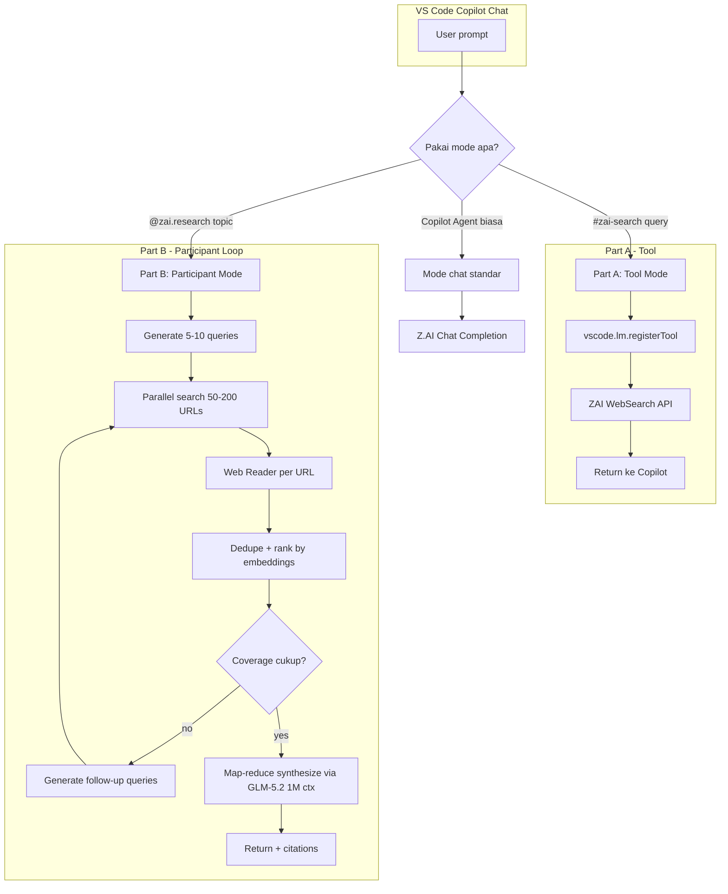

# Deep Research Implementation Plan — Z.AI Copilot Chat

> Status: **Proposal** — pending review before implementation
> Date: 2026-06-25
> Architecture: **Hybrid A+B** (Language Model Tool + Chat Participant)
> Search backend: **Z.AI Web Search API** + **Z.AI Web Reader API** (native, BYOK)

---

## 0. Executive Summary

Extension `zai-copilot-chat` saat ini hanya mendaftarkan model Z.AI ke Copilot Chat
via `LanguageModelChatProvider`. Tujuan plan ini: mengaktifkan kemampuan **deep
research** yang bisa fetch **ratusan sumber** internet, mengalahkan limit bawaan
Copilot (2-3 link per turn).

**Strategi Hybrid A+B:**
- **Part A — Language Model Tool** (`zai_webSearch`, `zai_webRead`, `zai_deepResearch`):
  tools yang otomatis muncul di tool picker Copilot Agent, bisa direferensikan via
  `#zai-search`. Cocok untuk single-shot search.
- **Part B — Chat Participant** (`@zai.research`): participant dengan kontrol penuh
  atas loop iterasi — generate queries → parallel fetch → rank → synthesize.
  Cocok untuk deep research multi-iteration ratusan sumber.

**Kenapa Hybrid?** Copilot Agent membatasi ~25 tool calls/turn (limit Microsoft).
Untuk research dangkal → Tool A cukup. Untuk research dalam ratusan sumber →
Participant B bypass limit karena loop dijalankan extension, bukan Copilot.

---

## 1. Riset: Z.AI Web Search & Web Reader API

### 1.1 Web Search API
- **Endpoint:** `POST https://api.z.ai/api/paas/v4/tools/web_search`
  (perlu konfirmasi exact path saat implementasi via OpenAPI spec)
- **Auth:** `Authorization: Bearer <ZAI_API_KEY>` (sama dengan chat)
- **Input:** `{ query: string, count?: number, search_intent?: "research"|"nav"|"auto" }`
- **Output:** array of `{ title, url, snippet, content_summary }`
- **Optimized untuk LLM** — bukan raw HTML, sudah intent-recognized

### 1.2 Web Reader API
- **Endpoint:** `POST https://api.z.ai/api/paas/v4/tools/web_reader`
- **Input:** `{ url: string, format?: "markdown"|"text"|"html", cache?: boolean, summary?: boolean }`
- **Output:** clean markdown/text (Readability-grade extraction server-side)
- **Menghemat token** — Z.AI side yang handle Readability + anti-bot

### 1.3 MCP Server Alternatif (untuk DevPack/Coding plan users)
Z.AI sudah publish MCP server resmi:
- `Web Search MCP Server` → `docs.z.ai/devpack/mcp/search-mcp-server`
- `Web Reader MCP Server` → `docs.z.ai/devpack/mcp/reader-mcp-server`

**Tapi kita tidak pakai MCP** karena extension kita sudah punya API key sendiri.
Panggil HTTP langsung lebih ringan, lebih cepat, dan tidak perlu spawn process.

### 1.4 Pricing (perlu konfirmasi)
Cek `docs.z.ai/guides/overview/pricing` saat implementasi. Asumsi: Web Search
metered per query (cheap), Web Reader per URL (cheap). Total cost deep research
1 topic ≈ $0.05-0.20 tergantung depth.

---

## 2. Arsitektur Teknis



---

## 3. File Structure yang Akan Dibuat

```
src/
├── extension.ts                    # EDIT: register tools + participant di activate()
├── research/
│   ├── index.ts                    # registerResearchFeatures(context, secrets)
│   ├── zaiApiClient.ts             # HTTP client Z.AI (search + read + chat)
│   ├── webSearchTool.ts            # Part A: LanguageModelTool implementation
│   ├── webReadTool.ts              # Part A: LanguageModelTool implementation
│   ├── researchParticipant.ts      # Part B: ChatParticipant handler
│   ├── orchestrator.ts             # Loop logic: plan → search → rank → synth
│   ├── ranker.ts                   # Cosine similarity dedupe + relevance scoring
│   ├── budget.ts                   # Token budget manager + maxIterations guard
│   ├── cache.ts                    # In-memory + workspace.fs persistent cache
│   └── types.ts                    # Shared interfaces
└── test/
    └── research/
        ├── webSearchTool.test.ts
        ├── orchestrator.test.ts
        └── ranker.test.ts
```

**Total: 9 file source baru + 3 file test. Edit 1 file (`extension.ts`) + `package.json`.**

---

## 4. Dependency Baru

```jsonc
// package.json — tambahkan
"dependencies": {
  "p-limit": "^6.1.0",          // Concurrency control (1 domain max 2 req/s)
  "normalize-url": "^8.0.1",    // URL dedupe
  "robots-parser": "^3.0.1"     // Respect robots.txt
}
```

**TIDAK perlu:**
- `playwright` — Z.AI Web Reader sudah handle JS rendering server-side
- `@mozilla/readability` — sama, server-side
- `openai` SDK — extension pakai `fetch` native (lihat `extension.ts` pattern existing)

---

## 5. package.json Contributions

```jsonc
"contributes": {
  "languageModelTools": [
    {
      "name": "zai_webSearch",
      "displayName": "Z.AI Web Search",
      "canBeReferencedInPrompt": true,
      "toolReferenceName": "zai-search",
      "icon": "$(search)",
      "modelDescription": "Search the web using Z.AI Web Search API. Returns 5-20 results with title, url, snippet. Optimized for LLM consumption. Use for factual queries requiring fresh internet data.",
      "userDescription": "Search the web via Z.AI",
      "inputSchema": {
        "type": "object",
        "properties": {
          "query": { "type": "string", "description": "Search query in natural language" },
          "count": { "type": "number", "default": 10, "maximum": 50 }
        },
        "required": ["query"]
      }
    },
    {
      "name": "zai_webRead",
      "displayName": "Z.AI Web Reader",
      "canBeReferencedInPrompt": true,
      "toolReferenceName": "zai-read",
      "icon": "$(book)",
      "modelDescription": "Read full content of a URL via Z.AI Web Reader API. Returns clean markdown extracted from page. Use when search result snippet is insufficient and you need full article text.",
      "userDescription": "Read a URL via Z.AI",
      "inputSchema": {
        "type": "object",
        "properties": {
          "url": { "type": "string", "format": "uri" },
          "format": { "type": "string", "enum": ["markdown","text"], "default": "markdown" }
        },
        "required": ["url"]
      }
    }
  ],
  "chatParticipants": [
    {
      "id": "zai.research",
      "name": "Z.AI Research",
      "description": "Deep research agent powered by Z.AI Web Search + Reader. Iterates queries, fetches hundreds of sources, synthesizes with citations.",
      "isSticky": true,
      "commands": [
        { "name": "deep", "description": "Maximum depth (200+ sources, slow)" },
        { "name": "quick", "description": "Quick depth (20-50 sources)" }
      ]
    }
  ],
  "configuration": {
    "properties": {
      "zai.research.maxSources": {
        "type": "number", "default": 100, "maximum": 500,
        "description": "Max number of sources fetched in deep research mode"
      },
      "zai.research.maxIterations": {
        "type": "number", "default": 5, "maximum": 10,
        "description": "Max query-expansion iterations before synthesis"
      },
      "zai.research.concurrency": {
        "type": "number", "default": 10, "maximum": 30,
        "description": "Parallel HTTP requests during fetch phase"
      },
      "zai.research.cacheTTL": {
        "type": "number", "default": 3600,
        "description": "Cache TTL in seconds for search/read results"
      }
    }
  }
}
```

---

## 6. Implementation Detail per File

### 6.1 `src/research/zaiApiClient.ts`
```typescript
export interface ZaiSearchResult { title: string; url: string; snippet: string; }
export interface ZaiReadResult { url: string; content: string; title?: string; }

export class ZaiApiClient {
  constructor(private apiKey: string, private baseUrl = "https://api.z.ai/api/paas/v4") {}

  async webSearch(query: string, count = 10): Promise<ZaiSearchResult[]> { /* fetch */ }
  async webRead(url: string, format: "markdown"|"text" = "markdown"): Promise<ZaiReadResult> { /* fetch */ }
  async chat(messages: ApiMessage[], opts): Promise<AsyncIterable<string>> { /* reuse extension.ts pattern */ }
}
```
**Pattern:** ikuti style `extension.ts` line 30 (sama-sama pakai `fetch` native +
retry logic dari `maxRetries` config).

### 6.2 `src/research/webSearchTool.ts` (Part A)
```typescript
export class ZaiWebSearchTool implements vscode.LanguageModelTool<{query: string; count?: number}> {
  constructor(private client: () => Promise<ZaiApiClient>) {}

  async prepareInvocation(options, token) {
    return {
      invocationMessage: `Searching web: ${options.input.query}`,
      confirmationMessages: {
        title: "Z.AI Web Search",
        message: new vscode.MarkdownString(`Search the web for: **${options.input.query}**?`)
      }
    };
  }

  async invoke(options, token) {
    const client = await this.client();
    const results = await client.webSearch(options.input.query, options.input.count ?? 10);
    return new vscode.LanguageModelToolResult([
      new vscode.LanguageModelTextPart(JSON.stringify(results, null, 2))
    ]);
  }
}
```

### 6.3 `src/research/orchestrator.ts` (Part B core)
```typescript
export interface ResearchPlan { queries: string[]; focusAreas: string[]; }
export interface ResearchSource { url: string; title: string; content: string; score: number; }
export interface ResearchResult { sources: ResearchSource[]; synthesis: string; citations: Citation[]; }

export class ResearchOrchestrator {
  constructor(
    private client: ZaiApiClient,
    private budget: BudgetManager,
    private ranker: Ranker,
    private config: ResearchConfig
  ) {}

  async run(topic: string, progress: vscode.Progress<{message?: string}>): AsyncGenerator<ResearchProgress> {
    // Phase 1: Plan
    yield* this.planQueries(topic);
    // Phase 2: Loop search + read + rank
    while (!this.budget.exhausted() && this.needsMoreCoverage()) {
      const queries = await this.expandQueries(topic);
      const results = await this.parallelSearch(queries);
      const sources = await this.parallelRead(results);
      this.ranker.add(sources);
      this.budget.consumeIteration();
    }
    // Phase 3: Synthesize
    yield await this.synthesize();
  }

  private async parallelSearch(queries: string[]): Promise<ZaiSearchResult[]> {
    const limit = pLimit(this.config.concurrency);
    return Promise.all(queries.map(q => limit(() => this.client.webSearch(q, 20)))).then(flatten);
  }
}
```

### 6.4 `src/research/budget.ts`
```typescript
export class BudgetManager {
  private tokenUsed = 0;
  private iterationsUsed = 0;
  private sourcesFetched = 0;

  constructor(private opts: { maxTokens: number; maxIterations: number; maxSources: number }) {}

  exhausted(): boolean {
    return this.tokenUsed >= this.opts.maxTokens
      || this.iterationsUsed >= this.opts.maxIterations
      || this.sourcesFetched >= this.opts.maxSources;
  }

  consumeTokens(n: number) { this.tokenUsed += n; }
  consumeIteration() { this.iterationsUsed++; }
  consumeSource() { this.sourcesFetched++; }
}
```

### 6.5 `src/research/researchParticipant.ts` (Part B entry)
```typescript
export function registerResearchParticipant(context: vscode.ExtensionContext) {
  const participant = vscode.chat.createChatParticipant("zai.research", async (request, ctx, stream, token) => {
    const client = await createClient(context);
    const orchestrator = new ResearchOrchestrator(client, budget, ranker, config);

    stream.progress("Planning research queries...");
    for await (const progress of orchestrator.run(request.prompt, /* progress */)) {
      stream.progress(progress.message);
    }
    const result = await orchestrator.finalize();
    stream.markdown(result.synthesis);
    stream.markdown("\n\n## Sources\n");
    for (const cite of result.citations) {
      stream.anchor(vscode.Uri.parse(cite.url), cite.title);
    }
  });
  participant.iconPath = new vscode.ThemeIcon("search");
  context.subscriptions.push(participant);
}
```

### 6.6 `extension.ts` edit
```typescript
// di activate(), tambahkan setelah registerChatProvider:
import { registerResearchFeatures } from "./research";
registerResearchFeatures(context, secrets);
```

---

## 7. Loop "Ratusan Sumber" — Detail

| Iteration | Action | Hasil kumulatif |
|---|---|---|
| 1 | Generate 5 queries dari prompt user | 5 queries × 20 results = 100 URLs candidate |
| 2 | Read top 30 most relevant (rank by snippet) | 30 sources extracted, ~150K tokens |
| 3 | Identify gaps → 5 follow-up queries | 50 URLs baru, dedupe → 25 unique |
| 4 | Read 25 baru | 55 total sources |
| 5 | Final synthesis via GLM-5.2 (1M ctx) | Research report + 55 citations |

**Untuk `deep` command:** `maxSources=200`, `maxIterations=8`, concurrency 20.
Estimasi 5-10 menit per research, cost ~$0.20.

**Untuk `quick` command:** `maxSources=20`, 1 iteration, concurrency 10.
Estimasi 30 detik, cost ~$0.02.

---

## 8. Trap & Mitigation

| Trap | Mitigation |
|---|---|
| Infinite loop di orchestrator | `BudgetManager.exhausted()` hard cap + `maxIterations` |
| Rate limit domain (1 domain di-fetch berulang) | `p-limit` per-domain bucket, max 2 req/s |
| Token blowup (ratusan pages > 1M context) | Map-reduce: summarize tiap 10 pages dulu, baru synth final |
| Duplikat URL (search engine return berbeda format URL) | `normalize-url` + Map<normalizedUrl, Source> |
| robots.txt | `robots-parser` per domain sebelum fetch |
| User tidak sadar biaya | `prepareInvocation` show confirmation dengan estimasi token |
| Cache stale | TTL 1 jam default, force-refresh via `cache: false` option |
| API key missing (BYOK) | Tool return `vscode.LanguageModelToolResult` dengan error message ke LLM, bukan throw |
| Z.AI Web Search API rate limit | Exponential backoff (sudah ada `maxRetries` config, reuse) |

---

## 9. Testing Strategy

### 9.1 Unit tests (`src/test/research/`)
- `ranker.test.ts` — dedup URL variants, BM25 score correctness
- `budget.test.ts` — exhaustion logic pada berbagai cap
- `orchestrator.test.ts` — mock ZaiApiClient, verify loop stop condition
- `webSearchTool.test.ts` — input validation, error message format

### 9.2 Integration (manual via Extension Dev Host)
1. F5 → launch Extension Dev Host
2. Buka Copilot Chat, pilih model Z.AI
3. Test Part A: ketik `@workspace #zai-search latest GLM models` → expect results
4. Test Part B: ketik `@zai.research quick deep research plan for AI coding tools 2026` → expect 20-50 sources + synthesis
5. Test deep: `@zai.research /deep state of AI coding agents June 2026` → expect 100+ sources

### 9.3 Production guardrails
- `maxSources` cap di config (default 100, hard cap 500)
- `maxIterations` hard cap 10
- Total time cap 15 menit (token timeout)
- Per-request timeout ikut `zai.requestTimeout` existing

---

## 10. Rollout Plan

### Phase 1 — MVP (3-4 hari)
- [ ] `zaiApiClient.ts` (search + read)
- [ ] `webSearchTool.ts` + `webReadTool.ts` (Part A)
- [ ] Edit `extension.ts` + `package.json` contributions
- [ ] Test Part A manual di Dev Host

### Phase 2 — Participant (3-4 hari)
- [ ] `orchestrator.ts`, `budget.ts`, `ranker.ts`, `cache.ts`
- [ ] `researchParticipant.ts` (Part B)
- [ ] Test deep + quick mode

### Phase 3 — Polish (2 hari)
- [ ] Map-reduce summarizer untuk mode deep
- [ ] Citation rendering (`stream.anchor`)
- [ ] Unit tests
- [ ] Docs di README

**Total estimasi: 8-10 hari kerja.**

---

## 11. Pertanyaan Terbuka

1. **Z.AI Web Search pricing** — perlu verifikasi cost per query saat implementasi
2. **Rate limit Z.AI Web Search** — perlu cek `docs.z.ai/api-reference/rate-limit`
3. **Apakah Z.AI Web Search support advanced query syntax** (site:, intitle:, dll)?
4. **Cache location** — `globalStorageUri` (extension-wide) atau `workspace.fs` (per-project)?
   Rekomendasi: `globalStorageUri/zai-cache/` dengan TTL config
5. **Participant vs Tool conflict** — saat user pakai `@zai.research`, apakah Copilot
   tetap inject tool bawaan? Perlu test.

---

## 12. References

- VS Code Language Model Tool API: https://code.visualstudio.com/api/extension-guides/ai/tools
- VS Code Chat Participants: https://code.visualstudio.com/api/extension-guides/chat
- Z.AI Web Search API: https://docs.z.ai/api-reference/tools/web-search
- Z.AI Web Reader API: https://docs.z.ai/api-reference/tools/web-reader
- Z.AI MCP Servers: https://docs.z.ai/devpack/mcp/search-mcp-server
- Extension sample resmi: https://github.com/microsoft/vscode-extension-samples/tree/main/chat-sample
