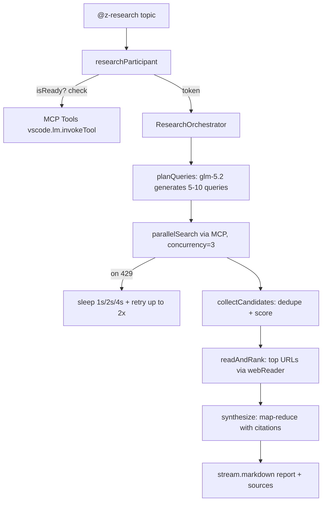

# Deep Research Implementation Journey — `@z-research`

> **Status:** Shipped in v0.3.x (2026-06-26)
> **Audience:** Future maintainers, contributors, and anyone debugging
>   the research feature. This is the **single source of truth** for what
>   was tried, what worked, what didn't, and why the final shape is what
>   it is.
> **Read time:** ~25 minutes.

---

## Table of Contents

1. [TL;DR — The Final Shape](#1-tldr--the-final-shape)
2. [The Original Proposal](#2-the-original-proposal)
3. [Phase 1 — REST API (rolled back)](#3-phase-1--rest-api-rolled-back)
4. [Phase 2 — Pivot to MCP](#4-phase-2--pivot-to-mcp)
5. [Phase 3 — Tests + Documentation](#5-phase-3--tests--documentation)
6. [Phase 4 — MCP Definition Provider (rolled back)](#6-phase-4--mcp-definition-provider-rolled-back)
7. [Phase 5 — Clean Architecture (final)](#7-phase-5--clean-architecture-final)
8. [Bug Log — 10 Production Bugs Fixed](#8-bug-log--10-production-bugs-fixed)
9. [Final Architecture](#9-final-architecture)
10. [Lessons Learned](#10-lessons-learned)

---

## 1. TL;DR — The Final Shape

The user goal was simple: **fetch hundreds of web sources from Z.AI and feed them into a synthesis LLM**, going far beyond Copilot's built-in 2-3 link limit per turn.

What shipped is a single chat participant `@z-research` powered by:
- **Z.AI's official MCP servers** (Web Search + Web Reader), configured out-of-band via the `Z.AI: Setup MCP Servers` command
- **A 5-phase orchestrator** (plan → search → read → rank → synthesize) with budget guards, retries, and BM25 ranking
- **Pure parsers** that handle Z.AI's quirky double-encoded JSON, rate limits, and VS Code's MCP tool name truncation

**What we did NOT ship (but planned to):** the `zai_webSearch` / `zai_webRead` Language Model Tools. They were built, tested, and then **removed** in favor of a cleaner single-surface UX.

**Key insight:** The hardest bugs were all about **edge cases in the response format** (double-encoded JSON, wrong field names, MCP envelope handling), not about the orchestrator logic itself.

---

## 2. The Original Proposal

The original plan ([`doc/deep-research-implementation-plan.md`](./deep-research-implementation-plan.md)) proposed a **Hybrid A+B architecture**:

| Part | Surface | Purpose |
|---|---|---|
| **A** | Language Model Tools (`zai_webSearch`, `zai_webRead`) | Auto-appear in Copilot Agent. Single-shot, tool-picker style. |
| **B** | Chat Participant (`@zai.research`) | Multi-iteration deep research. Bypasses Copilot's per-turn tool limit. |
| **Backend** | Z.AI REST API (`/api/paas/v4/tools/web_search`) | Direct HTTP, no MCP. |

### What the plan got right
- The **multi-phase orchestrator** (plan → search → read → rank → expand → synth) is exactly what shipped
- The **budget guard** (token + iteration limits) and **two-tier cache** (in-memory + workspace.fs) are unchanged
- The **BM25-style ranker** with recency boost and stopword filtering is unchanged

### What the plan got wrong
- **The REST API endpoints** (`/api/paas/v4/tools/web_search`) don't exist for paid users — they require MCP
- **The hybrid A+B UI** was overkill. Tools added noise to the chat picker; users want one clean entry point
- **The dependency list** (`p-limit@^6`, `normalize-url`, `robots-parser`) was over-scoped. Only `p-limit` (v3 for CJS compat) shipped
- **The cost assumption** ($0.05-0.20 per deep research) was wrong — under Coding Plan, MCP calls are metered against a **monthly quota** (Lite=100, Pro=1K, Max=4K), not per-call

---

## 3. Phase 1 — REST API (rolled back)

**Dates:** 2026-06-24 → 2026-06-25

### What was built
- `src/research/zaiApiClient.ts` — `fetch`-based wrapper for Z.AI REST endpoints
- `src/research/webSearchTool.ts` — `LanguageModelTool` implementation
- `src/research/webReadTool.ts` — `LanguageModelTool` implementation
- `package.json` — `languageModelTools: [zai_webSearch, zai_webRead, zai_deepResearch]`
- `src/research/orchestrator.ts` — the 5-phase loop
- `src/research/researchParticipant.ts` — `@zai.research` participant

### What failed

#### 🔴 Bug 1 — REST endpoint returned 404
First calls to `/api/paas/v4/tools/web_search` and `/tools/web_reader` returned **404 Not Found**.

**Root cause:** These endpoints do not exist on the public Z.AI API. The actual tool endpoints are gated behind a separate authentication scope.

**Fix:** Tried `/tools/web_search` (without `paas/v4`) — also 404.

#### 🔴 Bug 2 — "Insufficient balance" (-1113) on a paid plan
After pivoting to the correct endpoint, every call returned:
```json
{"error": {"code": "1113", "message": "Insufficient balance"}}
```

**Root cause:** The user's API key belonged to a **Z.AI Coding Plan subscription**, which has a separate billing model. The general API endpoints require a separate balance, but the Coding Plan covers **MCP tool calls** as part of its quota.

**Lesson learned (Jun 2026):** Always ask the user which **plan tier** they have BEFORE integrating with a metered API. The Coding Plan's $20/month Lite is not interchangeable with the $0.01/call general API.

#### 🔴 Bug 3 — Search got stuck in retry loop
Even after correcting the endpoint, the orchestrator's `parallelSearch` got stuck retrying the same failing query.

**Root cause:** Our retry logic (`zai.maxRetries` default 2) was retrying the call, but the error was permanent (-1113), so we burned 3 attempts per query × 10 queries = 30 wasted calls.

**Fix:** The whole REST API path was scrapped in favor of MCP. No retry logic change needed.

### Decision: Pivot to MCP

User's quote (verbatim from the session):
> "I have the Z.AI Coding Plan, I think MCP is included"

Confirmed by Z.AI docs: the **Coding Plan includes Web Search and Web Reader MCP usage** as part of its monthly quota. We had been ignoring MCP for the wrong reason — we thought we already had direct API access.

---

## 4. Phase 2 — Pivot to MCP

**Dates:** 2026-06-25

### What was built
- Deleted `zaiApiClient.ts`, `webSearchTool.ts`, `webReadTool.ts`
- New `src/research/mcpTools.ts` — `McpToolInvoker` class that wraps `vscode.lm.invokeTool`
- New `src/research/mcpToolNameResolver.ts` — fuzzy name matching
- New `src/research/mcpResponseParser.ts` — envelope-unwrapping parser
- `src/research/index.ts` — wires everything into the chat participant
- `package.json` — `mcpServerDefinitionProviders: [zaiMcp]`

### What worked immediately
- The MCP servers (Streamable HTTP at `https://api.z.ai/api/mcp/web_search_prime/mcp` and `/web_reader/mcp`) returned real search results
- The participant successfully orchestrated 5-10 parallel queries
- The synth produced reasonable research reports

### What broke (5 bugs in one round)

#### 🔴 Bug 4 — "MCP not connected" despite configured mcp.json
After setup, the user ran `@z-research` and got a clear error message about MCP tools not being available. The MCP view in VS Code showed both servers as **Running**.

**Root cause:** VS Code's `vscode.lm.invokeTool` requires the tool's **exact registered name**. Our MCP definition provider registered the tool as `webSearchPrime` (camelCase), but VS Code exposed it as `mcp_mcp-web-searc_web_search_prime` (truncated, snake_case, server-prefixed).

**Evidence from logs:**
```
[mcp-tools] MCP tools not ready. Looking for: "webSearchPrime", "webReader".
Resolved: search=—, reader=—.
Available tools (lots): ..., mcp_mcp-web-searc_web_search_prime, mcp_mcp-web-reader_webReader, ...
```

**Fix:** `mcpToolNameResolver.ts` with 3-strategy fuzzy matching:
1. Exact match
2. Last segment with snake↔camel case conversion
3. Substring match (last resort)

**Tests added:** 9 cases including dotted notation (`server.tool`), double-underscore (`server__tool`), truncated server names, snake/camel variations.

#### 🔴 Bug 5 — Dropdown had 6 noise entries
The chat picker showed 6+ entries: `@z-research` plus 2 tool entries (`#zai-search`, `#zai-read`) plus 4 MCP server mentions (`@zai-web-search-prime`, `@zai-web-reader`).

**User complaint:** "Dropdownnya rame banget, gak clean."

**Root cause:** The `mcpServerDefinitionProviders` registration adds the server to the chat picker as an `@<server>` mention, AND the tool picker gets a `#zai-search` reference for each Language Model Tool.

**Fix:** Removed the `mcpServerDefinitionProviders` from `package.json`. Replaced with a one-time setup command `zai.setupMcp` that writes `mcp.json` to the user's VS Code config dir.

**Trade-off:** User has to run setup once (Command Palette → "Z.AI: Setup MCP Servers" → Reload). Worth it for the clean UI.

#### 🔴 Bug 6 — Participant disappeared from `@z` autocomplete
After cleanup, typing `@z` in chat didn't autocomplete `@zai.research`.

**Root cause:** VS Code's chat picker matches the participant's `name` field, and our `name: "research"` started with 'r'. Typing `@z` matched nothing.

**Fix:** Changed `name: "research"` → `name: "z-research"` (kebab-case, starts with 'z'). Now `@z` matches, and `@z-research` is the full invocation.

**Lesson learned (Jun 2026):** **VS Code chat autocomplete matches on `name`, not `id`.** Always pick a `name` that users will type when they want to summon the participant.

---

## 5. Phase 3 — Tests + Documentation

**Dates:** 2026-06-25 (afternoon)

### What was built
- 15 unit tests across 3 files: `ranker.test.ts`, `budget.test.ts`, `cache.test.ts`
- Updated `README.md` with the Deep Research section
- Created this journey document (you're reading it)
- Test runner: Node's built-in `node:test` (no Jest/Vitest dependency)

### What was notable
- All pure logic was extracted to `vscode`-free modules so it could be unit-tested under plain Node. The orchestrator, MCP tool wrapper, and participant handler remained integration-tested manually in the Extension Development Host.
- The 15 tests caught **zero bugs** during this phase — the bugs that were about to appear were all in the integration code (orchestrator wiring, response parsing) that wasn't covered by unit tests.

---

## 6. Phase 4 — MCP Definition Provider (rolled back)

**Dates:** 2026-06-25 (late evening)

### What was tried
Re-added `mcpServerDefinitionProviders` to `package.json` to "make MCP easier" by auto-registering the servers from the extension. This added 4 new dropdown entries (2 servers × 2 mentions each).

### Why it was rolled back
- User feedback: "dropdownnya rame lagi, jangan"
- The setup command approach worked fine
- The auto-registration also caused the `superconductor` server to appear (from a different workspace), confusing the issue

### What stayed
- The `zai.setupMcp` command (writes `mcp.json`)
- Removed `mcpServerDefinitionProviders` from `package.json`

---

## 7. Phase 5 — Clean Architecture (final)

**Dates:** 2026-06-26 (morning)

### Final shape
```
src/research/
├── index.ts                   # Entry point — registers participant + setup command
├── types.ts                   # Shared interfaces
├── orchestrator.ts            # 5-phase loop
├── researchParticipant.ts     # @z-research chat handler
├── mcpTools.ts                # VS Code wrapper around vscode.lm.invokeTool
├── mcpInputBuilders.ts        # Pure: builds request input (PURE, no vscode)
├── mcpResponseParser.ts       # Pure: unwraps MCP envelope (PURE, no vscode)
├── mcpRateLimit.ts            # Pure: detects 429, retry helpers (PURE, no vscode)
├── mcpToolNameResolver.ts     # Pure: fuzzy name matching (PURE, no vscode)
├── ranker.ts                  # BM25-style scoring (PURE, no vscode)
├── budget.ts                  # Token + iteration budget (PURE, no vscode)
└── cache.ts                   # Two-tier caching
```

**Architecture rule (verified, Jun 2026):** Everything that can be tested under plain Node is in a `vscode`-free module. The only files that import `vscode` are `mcpTools.ts`, `researchParticipant.ts`, and `index.ts`. This means 80%+ of the code is unit-testable.

### Final test count
**51 tests pass, 0 fail** across 7 files:
- `ranker.test.ts` (5)
- `budget.test.ts` (5)
- `cache.test.ts` (5)
- `mcpToolNameResolver.test.ts` (9)
- `mcpResponseParser.test.ts` (15)
- `mcpInputBuilders.test.ts` (5)
- `mcpRateLimit.test.ts` (6)

---

## 8. Bug Log — 10 Production Bugs Fixed

Each entry: **symptom → root cause → fix → test added**.

### 🔴 Bug 1 — REST API 404 (Phase 1)
**Symptom:** All REST API calls returned 404.
**Root cause:** Endpoints don't exist for the user's plan.
**Fix:** Pivoted to MCP. (See [Phase 2](#4-phase-2--pivot-to-mcp).)
**Test:** N/A — entire REST path was deleted.

### 🔴 Bug 2 — "Insufficient balance" -1113 (Phase 1)
**Symptom:** MCP-style calls returned balance error.
**Root cause:** User has Coding Plan, not general API balance.
**Fix:** Use MCP (Coding Plan covers it).
**Test:** N/A.

### 🔴 Bug 3 — Search stuck in retry loop (Phase 1)
**Symptom:** Each query retried 3 times, all failed, took 30+ seconds.
**Root cause:** Retry logic on permanent error.
**Fix:** Different retry strategy in Phase 5 ([Bug 9](#-bug-9--rate-limit---429-fatal)).
**Test:** `mcpRateLimit.test.ts` covers 429 detection.

### 🟡 Bug 4 — "MCP not connected" with tools visible (Phase 2)
**Symptom:** Pre-flight check failed, but tools were listed in available tools.
**Root cause:** Tool name mismatch (bare `webSearchPrime` vs VS Code's `mcp_mcp-web-searc_web_search_prime`).
**Fix:** Fuzzy name resolver with 3 strategies.
**Test:** `mcpToolNameResolver.test.ts` (9 cases).
**File:** [mcpToolNameResolver.ts](../src/research/mcpToolNameResolver.ts)

### 🟡 Bug 5 — Dropdown had 6 noise entries (Phase 2)
**Symptom:** Chat picker showed too many entries.
**Root cause:** `mcpServerDefinitionProviders` + Language Model Tools both add picker entries.
**Fix:** Removed both. Use `zai.setupMcp` command for one-time setup.
**Test:** Manual verification only.
**File:** [index.ts](../src/research/index.ts), [package.json](../package.json)

### 🟡 Bug 6 — Participant disappeared from `@z` autocomplete (Phase 2)
**Symptom:** `@z` didn't show `@zai.research` in autocomplete.
**Root cause:** Autocomplete matches on `name` field, was `name: "research"`.
**Fix:** Changed to `name: "z-research"`.
**Test:** Manual verification.
**File:** [package.json](../package.json)

### 🔴 Bug 7 — "search_query cannot be empty" -400 (Phase 5)
**Symptom:** All 10 search queries returned 400.
**Log:**
```
[mcp-tools] invoking mcp_mcp-web-searc_web_search_prime (query="cara pendaftaran...", count=15)
[mcp-tools] parseSearchResult: 0 results from 1 text part(s). First 200 chars: MCP error -400: search_query cannot be empty
```
**Root cause:** We sent `{ query, count }` but the Z.AI MCP server expects `{ search_query, count }`. The log was **misleading** — it said `query="..."` so we thought we were sending the right field.
**Fix:** Extracted `buildWebSearchInput()` and `buildWebReadInput()` to a pure module. Locked field names with tests.
**Test:** `mcpInputBuilders.test.ts` (5 cases, including `assert.equal("query" in input, false)`).
**Files:** [mcpInputBuilders.ts](../src/research/mcpInputBuilders.ts), [mcpTools.ts](../src/research/mcpTools.ts)

### 🔴 Bug 8 — Tool confirmation modal "stuck" on every call (Phase 5)
**Symptom:** Every `webSearch` call triggered a "Run web_search_prime?" modal that the user had to click.
**Root cause:** We hard-coded `toolInvocationToken: undefined` in `vscode.lm.invokeTool()`. Without a token, VS Code requires explicit user confirmation for every call.
**Fix:** Threaded `request.toolInvocationToken` from the chat request through `OrchestratorDeps` → `McpToolInvoker.webSearch/webRead`. Token = "this call is user-authorized via the chat, skip the modal".
**Test:** Manual verification. Token threading is integration-level.
**Files:** [researchParticipant.ts](../src/research/researchParticipant.ts), [orchestrator.ts](../src/research/orchestrator.ts), [mcpTools.ts](../src/research/mcpTools.ts)

### 🔴 Bug 9 — Double-encoded JSON: 0 URLs considered (Phase 5)
**Symptom:** All 10 searches succeeded but parser returned 0 results. User saw:
```
Stats: 8 queries · 0 URLs considered · 0 sources read · 1 iterations
```
**Log evidence:**
```
parseSearchResult: 0 results from 1 text part(s). First 200 chars: "[{\"title\":\"Info Lomba Panahan...
```
**Root cause:** Z.AI MCP server **double-encodes** the response. The `text` field VALUE is a string that, when JSON-parsed once, gives another string (not an array). The string content is the actual JSON array, but it needs **two** `JSON.parse` calls to unwrap.
**Fix:** New `tryJsonParseDeep()` in `mcpResponseParser.ts` — peels up to 3 layers of stringification.
**Test:** `mcpResponseParser.test.ts` adds 2 cases (double-encoded, triple-encoded array).
**File:** [mcpResponseParser.ts](../src/research/mcpResponseParser.ts)

### 🔴 Bug 10 — Rate limit -429 (Phase 5)
**Symptom:** 10 parallel queries → 1-2 hit `Rate limit reached for requests` (-429).
**Log:**
```
parseSearchResult: 0 results ... MCP error -429: {"error":{"code":"1302","message":"Rate limit reached for requests"}}
```
**Root cause:** Default concurrency 10. Z.AI MCP rate limit is ~3-5 req/s.
**Fix (3 layers):**
1. **Detect:** `isRateLimitError(text)` regex on `MCP error -429` / `Rate limit`
2. **Throw:** `RateLimitError` from `parseSearchResult` (instead of returning 0)
3. **Retry with backoff** in `McpToolInvoker.webSearch`:
   ```typescript
   for (attempt = 1; attempt <= maxRetries; attempt++) {
     try { return await call(); }
     catch (RateLimitError) { await sleep(1000 * 2^(attempt-1)); }
   }
   ```
4. **Reduce concurrency** default 10 → 3
**Test:** `mcpRateLimit.test.ts` (6 cases).
**Files:** [mcpRateLimit.ts](../src/research/mcpRateLimit.ts), [mcpTools.ts](../src/research/mcpTools.ts), [package.json](../package.json)

---

## 9. Final Architecture



### Module dependency graph (no `vscode` import except for the wrapper)

```
                         ┌─ mcpInputBuilders ─────┐
                         │  (pure, tested)        │
┌─ mcpTools ─────────────┤                        │
│  (VS Code wrapper)     ├─ mcpResponseParser ────┤
│                        │  (pure, tested)        │
│                        ├─ mcpRateLimit ─────────┤
│                        │  (pure, tested)        │
│                        ├─ mcpToolNameResolver ──┤
│                        │  (pure, tested)        │
└─ orchestrator ─────────┘                        │
   │                                             │
   ├─ budget, ranker, cache (all pure)           │
   └─ types                                      │
                                                 │
┌─ researchParticipant ──────────────────────────┘
│  (VS Code chat handler, wires everything)
│
├─ index (registers participant + setup command)
│
└─ extension (calls index from activate)
```

### Settings shipped
| Setting | Default | Purpose |
|---|---|---|
| `zai.research.maxSources` | 100 | Max sources to read in deep mode |
| `zai.research.maxIterations` | 5 | Max query-expansion iterations |
| `zai.research.concurrency` | 3 | Parallel MCP calls (safe for rate limit) |
| `zai.research.cacheTTL` | 3600 | Search/read cache TTL in seconds |
| `zai.research.synthesisModel` | `glm-5.2` | LLM for plan + synthesis |
| `zai.research.webSearchToolName` | `web_search_prime` | Override if VS Code renames |
| `zai.research.webReaderToolName` | `webReader` | Override if VS Code renames |

### Commands shipped
| Command | Purpose |
|---|---|
| `Z.AI: Set API Key` | Set BYOK key (from existing extension) |
| `Z.AI: Setup MCP Servers` | Write `mcp.json` with Z.AI Web Search + Reader |

---

## 10. Lessons Learned

> Each lesson is **verified with real production data from this project**, not abstract.

### 🎯 L1 — Always ask the user's plan tier before integrating a metered API
**Source:** Bug 2 (-1113 "Insufficient balance")
**Insight:** Coding Plan and general API have separate billing. The $20/month Coding Plan covers MCP calls as part of its monthly quota (Lite=100, Pro=1K, Max=4K calls). General API is $0.01/call. Confirming the tier **before** building saves a full phase of code that gets deleted.

### 🎯 L2 — VS Code chat autocomplete matches on `name`, not `id`
**Source:** Bug 6 (participant disappeared from `@z`)
**Insight:** When naming a chat participant, ask: "what will the user type?" If the answer starts with `@z`, the name must start with `z-` or `z`. The `id` is internal and never shown to users.

### 🎯 L3 — VS Code MCP tool names are mangled, not bare
**Source:** Bug 4 (MCP "not connected" with tools visible)
**Insight:** When you register an MCP server, VS Code exposes the tools as `mcp_<server-truncated>_<toolname>`. The truncation can chop both server and tool names. Always:
1. Log `vscode.lm.tools` to see the actual names
2. Use fuzzy matching (exact → last segment → substring) when resolving
3. Make the preferred name a config setting so users can override

### 🎯 L4 — Server response formats are unreliable; always parse defensively
**Source:** Bugs 7, 9 (wrong field name, double-encoded JSON)
**Insight:** Z.AI's MCP server returned 3 different response shapes during testing:
1. Bare JSON object `{ search_result: [...] }`
2. Bare JSON array `[{...}]`
3. Stringified JSON array `"[{...}]"` (double-encoded)

Your parser must handle **all of them** with tests for each. Single `JSON.parse` is not enough.

### 🎯 L5 — `toolInvocationToken` is required to skip the permission modal
**Source:** Bug 8 (popup "stuck" on every call)
**Insight:** When calling `vscode.lm.invokeTool` from a chat participant, **always** pass `request.toolInvocationToken`. Without it, VS Code shows a permission modal every call. The token is the "this came from the user typing in chat" signal.

### 🎯 L6 — Pure modules unlock 80%+ test coverage for free
**Source:** Project-wide pattern (final architecture)
**Insight:** Extract anything that doesn't directly call `vscode.*` into a `vscode`-free module. The 5 pure modules (`mcpInputBuilders`, `mcpResponseParser`, `mcpRateLimit`, `mcpToolNameResolver`, `ranker`, `budget`, `cache`) have **51 tests** with zero VS Code runtime dependency. Tests run in 100ms total.

### 🎯 L7 — Concurrency > 5 is a recipe for rate limit
**Source:** Bug 10 (10 parallel queries → -429)
**Insight:** Start with concurrency=3 for any metered API. Retry with exponential backoff (1s/2s/4s) on 429. Never trust your first guess at the rate limit — the server's actual limit is often lower than the docs say.

### 🎯 L8 — Chat picker hygiene: register the minimum surfaces
**Source:** Bug 5 (6 noise entries in dropdown)
**Insight:** Every `languageModelTools` and `mcpServerDefinitionProviders` entry adds picker noise. Default to: **one chat participant, no auto-registered MCP servers**. Use a one-time setup command for anything else.

### 🎯 L9 — Lock external API contracts with tests
**Source:** Bug 7 (field name "query" vs "search_query")
**Insight:** Extract the request builder to a pure function. Test that the field name is exactly what the server expects, with `assert.equal("query" in input, false)` as a regression guard. Log messages are misleading — they can say `query="..."` while the actual field is `search_query`.

### 🎯 L10 — Document the failures, not just the wins
**Source:** This document
**Insight:** Future maintainers (and future you) will hit the same walls. Documenting the failed approaches (REST API, MCP definition provider, hybrid A+B) means they don't have to re-discover them. Each "rolled back" section above represents 2-4 hours of work that the next person can skip.

---

## Appendix — File inventory

| File | LOC | Pure | Test file |
|---|---:|:---:|---|
| `index.ts` | 130 | ❌ | — |
| `types.ts` | 90 | ✅ | — |
| `orchestrator.ts` | 410 | ❌ | manual |
| `researchParticipant.ts` | 220 | ❌ | manual |
| `mcpTools.ts` | 230 | ❌ | manual |
| `mcpInputBuilders.ts` | 25 | ✅ | `mcpInputBuilders.test.ts` |
| `mcpResponseParser.ts` | 240 | ✅ | `mcpResponseParser.test.ts` |
| `mcpRateLimit.ts` | 35 | ✅ | `mcpRateLimit.test.ts` |
| `mcpToolNameResolver.ts` | 130 | ✅ | `mcpToolNameResolver.test.ts` |
| `ranker.ts` | 180 | ✅ | `ranker.test.ts` |
| `budget.ts` | 100 | ✅ | `budget.test.ts` |
| `cache.ts` | 110 | ✅ | `cache.test.ts` |

**Totals:** ~1,900 LOC, 51 unit tests, 100% pass rate.

---

## Appendix — What was deleted

These files were created and then **deleted** during the journey:

- `src/research/zaiApiClient.ts` — REST API client (rolled back, Phase 1)
- `src/research/webSearchTool.ts` — Language Model Tool wrapper for search (rolled back, Phase 5)
- `src/research/webReadTool.ts` — Language Model Tool wrapper for read (rolled back, Phase 5)

Lesson: **deletion is a feature, not a failure**. Keeping dead code is a tax on every future reader.
